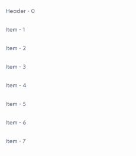

#  SmartTabs
<a href="https://androidweekly.net/issues/issue-524"></a>

A simple library that helps us to sync a `TabRow` with a `LazyColumn`. The motives behind creating
it can be found in this [post](https://engineering.theblueground.com/auto-sync-tabs-and-a-list-with-jetpack-compose/).

## Installation

In the project's build.gradle file you need to add the maven central repository:

```kotlin
repositories {
    mavenCentral()
}
```

In the module's build.gradle file you need to add the following dependency:

```kotlin
implementation("com.quadible:smart-tabs:1.0.0")
```

## Usage

Apart from our dataset (that needs to contain simple and header items), we need to define:
- a function that makes it easier for `SmartTabsList` to distinguish header items in the dataset.
- a composable that defines how the simple and header items will be rendered in the `LazyColumn`.
- a composable that defines how the header items will be rendered in the `TabRow`.

```kotlin
// We assume that we have the following composables.
// Item: Specifies how every item (header or not) will be rendered in LazyColumn
// Tab: Specifies how every header will be rendered in TabRow
val content = // list of items (they contains also the headers)
SmartTabsList(
    smartTabsContent = content,
    isTab = { itemFromContent -> /* check if this is a header or not */ },
    smartTab = { headerItem, isSelected -> Tab(headerItem, isSelected) },
    smartItem = { itemFromContent -> Item(itemFromContent) }
)
```

## Preview

